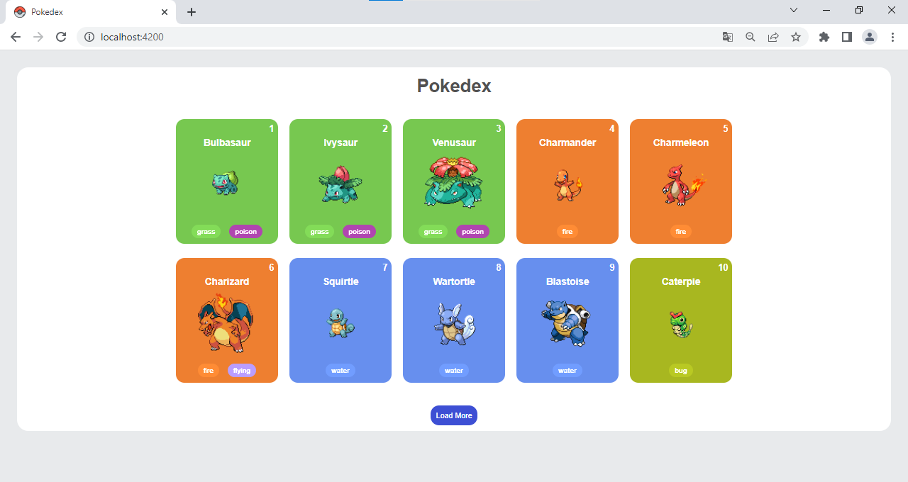

<h1>Pokedex</h1>

Pokedex desenvolvida com Angular, que consome a PokeAPI para pegar os dados dos pokemons e exibir nos cards, com informações sobre diferentes pokémons. Inicialmente, são carregados 10 pokemons e há um botão para carregar mais 10 a cada clique, até exibir um total de 200 pokemons. Uma vez que o limite de 200 pokémons é atingido, o botão de carregamento é removido.

<h2>Pré-requisitos</h2>

Antes de executar a aplicação, certifique-se de ter o seguinte instalado:

<ul>
    <li>Node.js</li>
    <li>Angular CLI</li>
</ul>

<h2>Instalação</h2>

Siga as instruções abaixo para configurar e executar a aplicação localmente:

<ol>
    <li>Clone o repositório para sua máquina local: <code>git clone https://github.com/seu-usuario/pokedex-angular.git
</code></li>
    <li>Navegue até o diretório do projeto: <code>cd pokedex-angular</code></li>
    <li>Instale as dependências do projeto: <code>npm install</code></li>
</ol>

<h2>Executando a Aplicação</h2>

Para iniciar a aplicação, execute o seguinte comando no diretório do projeto: <code>ng serve</code>

Isso iniciará o servidor de desenvolvimento e a aplicação poderá ser acessada em http://localhost:4200

<h2>Utilização</h2>

Ao acessar a aplicação, você verá uma lista inicial de 10 cards de pokémons. Cada card exibe informações básicas, como o nome, foto, número e tipo do pokémon.

No final da página, há um botão "Load More". Ao clicar nesse botão, serão carregados mais 10 cards de pokemons. Você pode continuar clicando no botão até que todos os 200 pokemons sejam exibidos. Após alcançar essa quantidade, o botão "Load More" desaparecerá.

<h2>Tecnologias utilizadas</h2>

Copyright © DavidWillian

